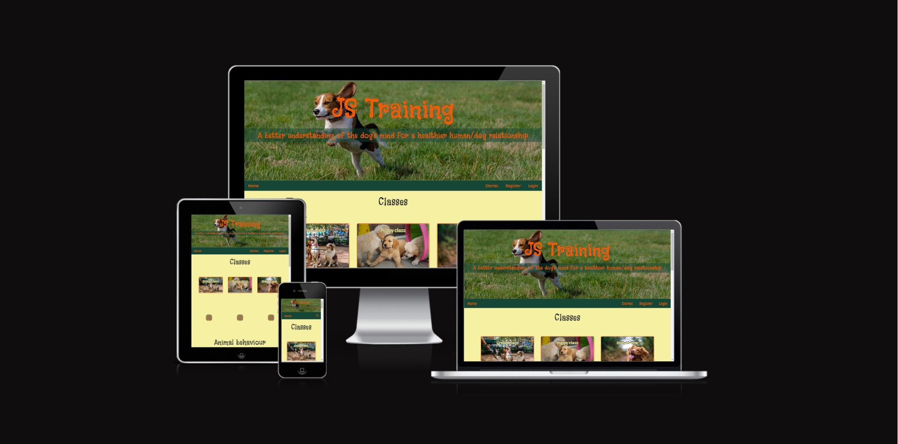
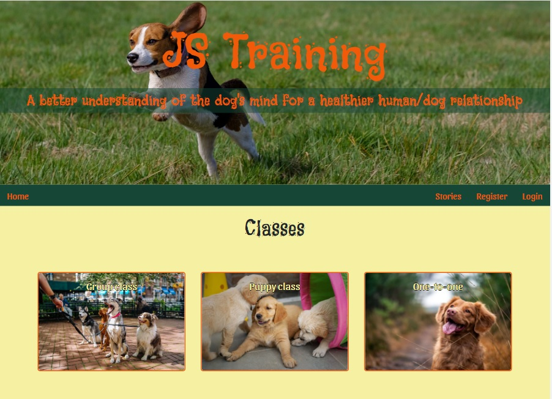
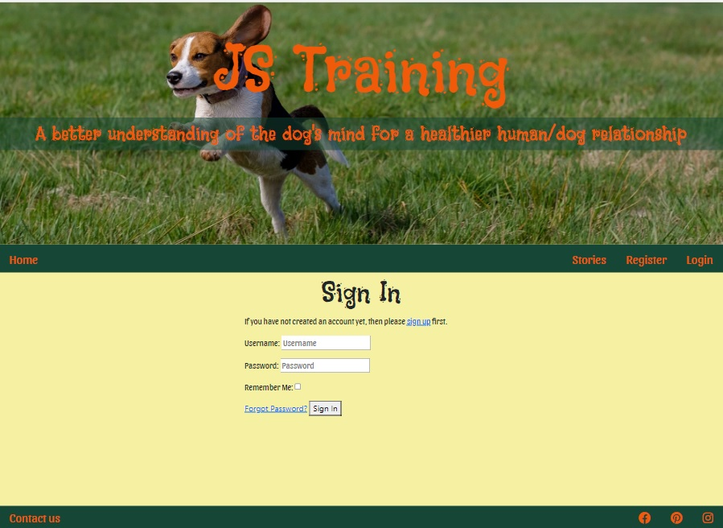
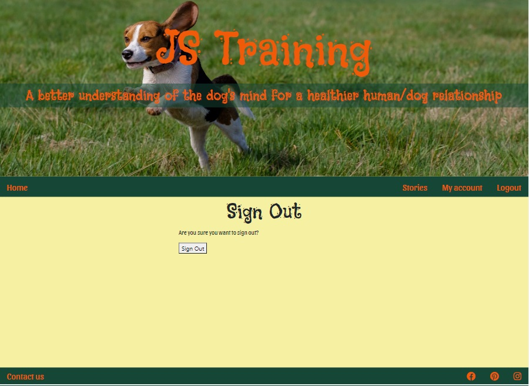
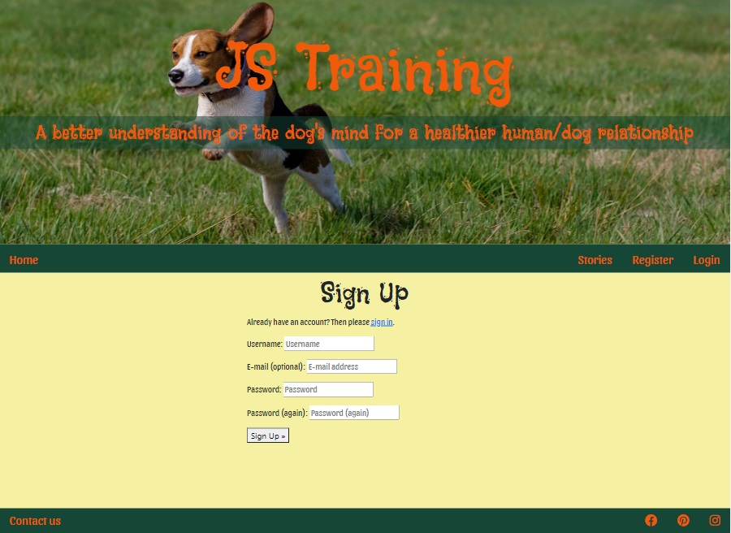
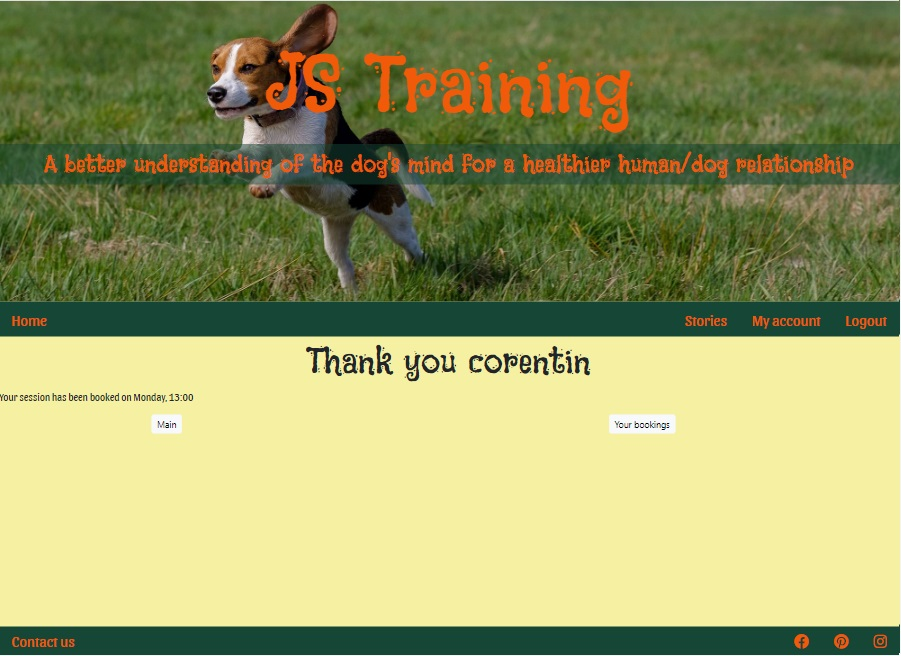
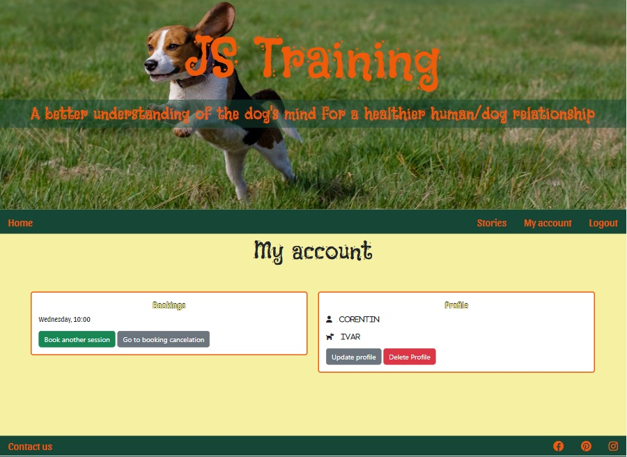
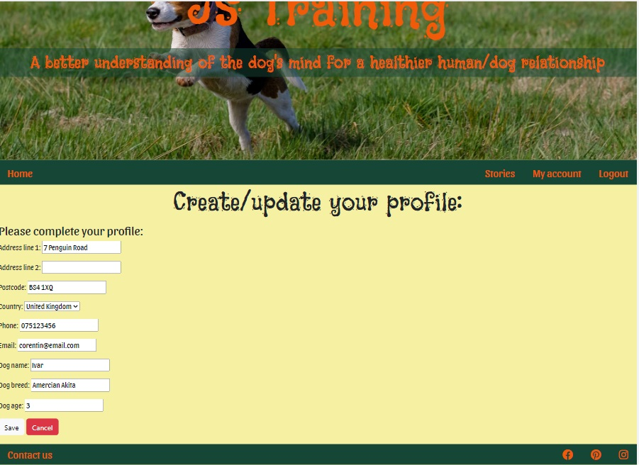

# P4 JSDOGTRAINING

JSTraining is a website designed for a dog trainer's clients to book training sessions. The website describes what type of classes are on offer, gives a chance to the client to create an account and book a session.
Users can see their bookings and delete them. They can also create, edit and delete a profile which, if created, will fill the booking form automatically with their address, phone number... Users can also send a message to the admin through the "Contact us" button.
The trainer (as an admin) can create sessions (day and time), delete booked sessions, view users' profile and view and delete messages from the "Contact us" form.

https://ui.dev/amiresponsive?url=https://jstraining.herokuapp.com

## UX

In order to design the page I spoke with a dog trainer to get information on what kind of data and functionalities he would like on his page. I also created a persona which had interest but no knowledge about dog trainng classes nor any particular computer skills. The website had to be self-explanatory and easy to follow from page to ge, clearly marking the required actions.
I settled on a main page, a booking and profile section and a contact form. Inspiration for the main page was taken from https://www.youtube.com/watch?v=g0db5kA4BfQ&list=PLqr9So6FmE4M6tS1LvpokGKp_lp56XFF6&index=8&t=300s&ab_channel=TheWebsiteArchitect .

### Colour Scheme

For the colour palette I wanted something that would remind nature and hope. My primary colour is yellow as it represents happiness, optimism and positivity, and green as my secondary colour as it evokes harmony, growth and safety.

- `#F6F0A2` used for primary background colour.
- `#F15A09` used for primary text.
- `#154636` used for secondary background colour.

I used [coolors.co](https://coolors.co/154636-69b7e1-64d373-f6f0a2-f15a09) to generate my colour palette.

Coolors

### Typography

Two fonts were used to create this website:

- A fun and "messy" (to match untrained dogs) font for the main headers and titles
[Black And White Picture](https://fonts.google.com/specimen/Black+And+White+Picture)

- A more serious but still inviting font for the text and links
[Montserrat](https://fonts.google.com/specimen/Sansita)

Font awesome icons were used for the social media icons in the footer.

[Font Awesome](https://fontawesome.com)

## User Stories

### New Site Users

- As a user I can view the main page so that I can navigate through the website.
- As a user I can view the articles' overview so that see if I am interested in something.
- As a user I can contact the admin so that they can answer my question.
- As a user I can create an account so that I can log in and book a session / comment an article / create an account.

### Registered Site Users

- As a site user I can be notified of my actions so that I can know my action was successful.
- As a site user I can click on an available slot so that I can book a class.
- As a site user I can view my bookings so that I can delete them if I want.
- As a site user I can delete a booking so that my session is cancelled.
- As a site user I can add a comment so that I can comment on an article.
- As a site user I can create/read/update/delete my profile so that update my personal details.
- As a site user I can log in/out so that access my account.
- As a site user I can click on an available slot so that I can book a class.

### Site Admin

- As a site administrator, I can view created profiles so that I can see users' information.
- As a site administrator, I can delete booked sessions so that cancel a booking.
- As a site administrator, I can view booked sessions so that I know how busy I am.
- As a site administrator, I can create/read/update/delete sessions so that I can manage my week's program.
- As a site administrator, I can view submitted contact forms so that I can answer their questions.

## Features

### Existing Features

- **Main page**

    - This is the home page. It tries to capture the user's attention and focus them on booking a class. It explains what kind of training is offered and why the user should choose JS training. It also highlights the ability to contact the owner of the page. It gives (currently fake) comments to show how happy previous customers are with the service offered.

        

Home page

        
        

- **Login, Logout and Register**

    - Users can create an account, log in and out of their account. This is required in order to book a session.

        

Registration

        
        
        
        

- **Session booking**

    - Can pick a session from all available slots. Address and phone are required to complete the process. Those details are automatically filled in if the user has created a profile.

        

Registration

        
        

- **Booking confirmation**

    - When a booking is made, a recap of the information is displayed to the user to clearly confirm that the booking has been made.

        

Registration

        
        

- **My account**

    - Displays current bookings to the user, giving opportunity to book another session or delete a booked one. It also displays the user's profile, which can be created, edited or deleted.

        

Registration

        
        

- **Booking cancelation**

    - Displays current bookings to the user, giving opportunity to cancel them one by one.

        

Registration

        
        

- **Profile creation/update**

    - Allows user to create and update their profile. This gives more information to the admin as well as auto-fill the booking form.

        

Registration

        
        

- **Profile deletion**

    - Allows user to delete their profile.

        

Registration

        
        

- **Contact**

    - Allows user to send a message to the admin wether they are registered or not.

        

Registration

        
        

- **Contact confirmation**

    - Confirms to user their message has been sent. Gives them the opportunity to jump to homepage or register.

        

Registration

        
        

- **Story overview**

    - Allows user to see articles and their preview two by two.

        

Story overview

        
        

- **Single story**

    - Allows user to see a whole article.

        

Single story

        
        

- **Comments**

    - Allows user to see comments and comment themselves if logged on.

        

Registration

        
        

- **Modals**

    - Modals are used to ask for user's confirmation when canceling a booking or deleting their profile.

        

Registration

        
        
        

### Future Features
